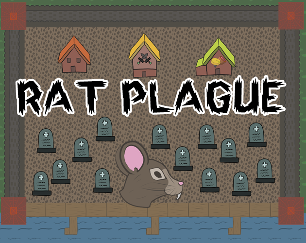

# Rat Plague
Game for [Indie Spain Jam 2022](https://itch.io/jam/indie-spain-jam)

**Theme:** From 0 to 100

**Sub theme:** replayability
## Description
As a rat your objective is reproduce your specie and spread the black plague. To fulfill your mission, assign your rats to the different buildings, but be careful due your rats may die in the buildings. Also control your reproduction, if humans see too many rats (100) they will be quarantined and you will lose.

## Credits
**Game Developed by G4M30V3R T34M**
### Art
 - @Neengash (Instagram, [Github](https://github.com/Neengash), [itch.io](https://neengash.itch.io/))
### Dessign and Development
 - @Neengash (Instagram, [Github](https://github.com/Neengash), [itch.io](https://neengash.itch.io/))
 - @XubecGames (Instagram, [Github](https://github.com/jaumeriera), [itch.io](https://xubecgames.itch.io/))
### Fonts
 - [Darker](https://www.dafont.com/darker.font) by Kong Font - ONLY for NON COMMERCIAL USE or PERSONAL USE ONLY
 - [Cardinal](https://www.dafont.com/cardinal.font?fpp=200) by Steffmann - 100% free

### Music
- [Background music](https://incompetech.com/music/royalty-free/music.html) - "Village Consort" Kevin MacLeod (incompetech.com) Licensed under Creative Commons: By Attribution 4.0 License http://creativecommons.org/licenses/by/4.0/
- [Click on house](https://freesound.org/people/Breviceps/sounds/448081/) - "Tic Toc Clickt" Breviceps (freesound.org) Licensed under the Creative Commons 0 License.
- [Rat](https://freesound.org/people/egomassive/sounds/536753/) - "Rat.ogg" egomassive (freesound.org) Licensed under the Creative Commons 0 License.

### Other Assets
- [Unity FeTo](https://github.com/Neengash/UnityFeTo)  Licensed under the Creative Commons 0 License.
